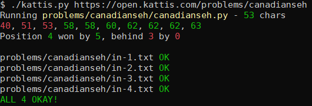
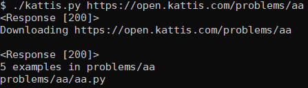
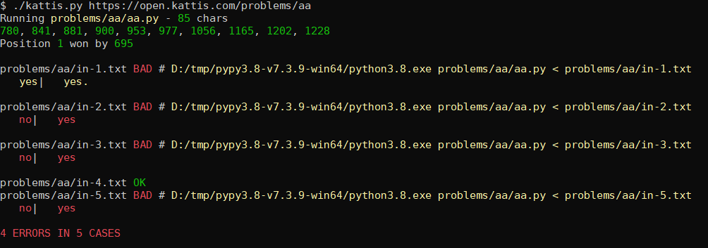

# Kattis Script
This is a simple script I've made to automate downloading examples from
[Kattis](https://open.kattis.com/) and then running the solution against them.

It always takes problem URL as the argument, and if that problem was not
downloaded yet it will be downloaded and directory and empty .py script
created.

On second and next execution with same problem it will run the
.py script with all inputs and check them against outputs, marking where
there are matches, mismatches, or mismatches just by whitespace.

It uses right PyPy version as described in Kattis Help section, and marks
output with color coding and prints commands to rerun given input with PyPy.

It also counts the numbe of characters in the .py file, since I often try
to get the shortest program, or at least within top 10 shortest ones.

This is a personal script but I share it in case it might be useful or
educational. See screenshost and source code for more.

